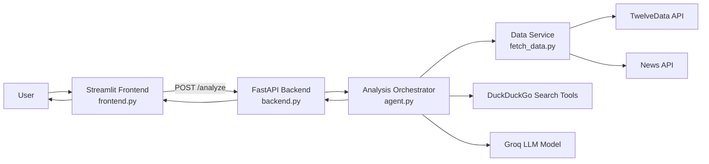
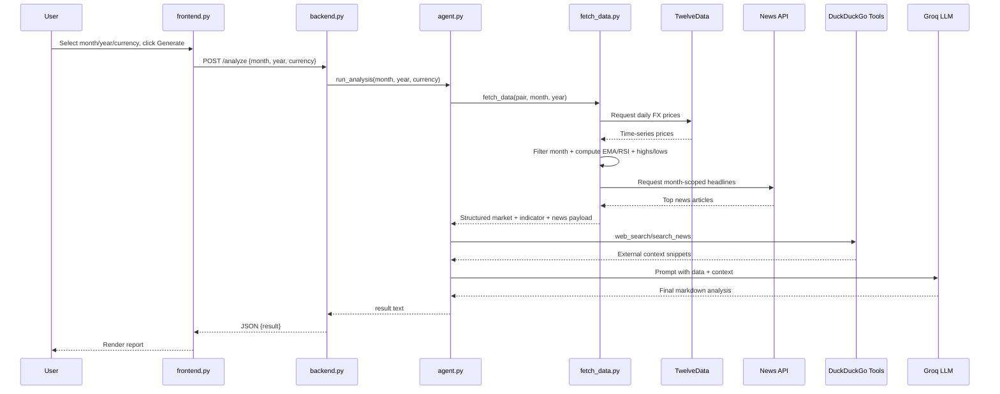

# FX Project - Detailed Workflow, Data Flow, and System Architecture

## 1. System Purpose
This project generates a financial analysis report for a selected currency pair and month/year by combining:
- Historical FX market data
- News context
- Tool-assisted LLM analysis
- A web UI for user interaction

## 2. Core Components

### 2.1 Presentation Layer
- Streamlit UI: frontend.py
- Responsibilities:
  - Collect month, year, currency pair from user
  - Trigger report generation
  - Render result or errors

### 2.2 API Layer
- FastAPI service: backend.py
- Responsibilities:
  - Expose HTTP endpoints for analysis
  - Validate request payloads using Pydantic models
  - Call the analysis engine and return standardized JSON

### 2.3 Orchestration/Intelligence Layer
- Agent orchestration: agent.py
- Responsibilities:
  - Build prompt context from computed market data + headlines
  - Use Agno Agent with Groq model
  - Force tool usage (web search/news) before producing report

### 2.4 Data Acquisition & Analytics Layer
- Data collector and indicators: fetch_data.py
- Responsibilities:
  - Fetch daily FX prices from TwelveData
  - Compute monthly high/low/last price
  - Compute EMA50, EMA200, RSI
  - Fetch month-scoped news headlines from News API

### 2.5 External Dependencies
- TwelveData API (price series)
- News API (headline context)
- Groq model endpoint (LLM)
- DuckDuckGo tools (web search + news search)

## 3. Request-Response Workflow (Runtime)

### Step-by-step flow
1. User selects inputs in Streamlit UI (month, year, currency pair).
2. UI sends POST request to backend endpoint /analyze.
3. FastAPI validates JSON into AnalysisRequest model.
4. Backend calls run_analysis(month, year, currency).
5. run_analysis calls fetch_data(currency, month, year).
6. fetch_data:
   - Normalizes month (string to numeric where needed)
   - Pulls daily FX prices from TwelveData
   - Filters selected month/year
   - Computes technical indicators (EMA50, EMA200, RSI)
   - Pulls month-bounded news headlines from News API
   - Returns structured market + news payload
7. run_analysis composes a structured prompt with market data + technicals + news context.
8. Agent invokes tool-assisted search/news retrieval, then calls LLM for final report synthesis.
9. run_analysis returns markdown report content to backend.
10. Backend returns JSON response: { result: <report_markdown> }.
11. Frontend renders report markdown to user.

## 4. High-Level Architecture Diagram

## 5. Detailed Data Flow

### 5.1 Input Payload
From frontend to backend:
- month: string (example: March)
- year: integer (example: 2026)
- currency: string (example: USDINR)

### 5.2 Internal Data Contract (from fetch_data)
- currency_pair
- month
- year
- market_data
  - monthly_high
  - monthly_low
  - last_price
- technical_indicators
  - ema50
  - ema200
  - rsi
- news

### 5.3 Output Payload
From backend to frontend:
- result: markdown string containing report sections

## 6. Sequence Diagram (Execution)

## 7. Configuration and Environment Variables

The system depends on these environment variables:
- GROQ_API_KEY
- TWELVEDATA_API_KEY
- NEWS_API_KEY
- BACKEND_URL (used by frontend for backend route)

Recommended local value:
- BACKEND_URL=http://127.0.0.1:8000/analyze

## 8. Reliability and Failure Points

### 8.1 Frontend configuration
- If BACKEND_URL is missing/invalid, request cannot be sent.
- Mitigation: default fallback + startup validation in frontend.

### 8.2 External API dependencies
- TwelveData or News API may fail, return empty payload, or exceed quota.
- Mitigation:
  - Add retry + timeout + defensive checks around response fields.
  - Show actionable error messages to user.

### 8.3 Agent/LLM dependency
- Model/tool availability can affect latency and reliability.
- Mitigation:
  - Add request correlation IDs and timing logs.
  - Add graceful fallback narrative when tools are unavailable.

### 8.4 Data assumptions
- Technical indicators require sufficient historical rows.
- Mitigation:
  - Validate minimum data length before EMA/RSI computation.
  - Return controlled errors for insufficient data.

## 9. Suggested Production-Grade Architecture Enhancements

1. Add service boundaries:
- Split into services: ui-service, api-service, analysis-service, data-service.

2. Introduce asynchronous job execution:
- Queue long-running analysis tasks (for responsiveness and retries).

3. Add observability stack:
- Structured logs, request tracing, latency/error dashboards.

4. Add caching layer:
- Cache FX time-series and news by pair+month+year.

5. Add API gateway and auth:
- Token-based access, rate limits, and request validation.

6. Add testing layers:
- Unit tests for indicators and data parsing.
- Integration tests for /analyze flow.
- Contract tests for external API adapters.

7. Add deployment architecture:
- Containerized services, environment-specific configs, health checks.

## 10. File-to-Responsibility Map

- frontend.py: UI controls, user interactions, backend invocation, rendering.
- backend.py: API contract, endpoint exposure, orchestration entrypoint.
- agent.py: prompt construction, tool-enabled LLM analysis workflow.
- fetch_data.py: external data retrieval and technical indicator computation.
- requirements.txt: dependency lock for local reproducibility.
- runtime.txt: Python runtime target.

## 11. End-to-End Summary
User input enters through Streamlit, gets validated and routed through FastAPI, enriched by data fetched from financial/news providers, augmented with tool-based market context, analyzed by an LLM agent, and returned as a structured markdown report to the UI.
